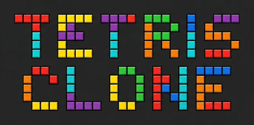

# Tetris Clone
A simple browser-based Tetris clone built with HTML, CSS, and vanilla JavaScript. No libraries, no installation, just open and play.

## How to Play
- Arrange falling tetromino pieces to fill horizontal lines.
- Filled lines clear and remaining blocks drop down.
- Game ends if pieces stack above the lose line at the top of the well.

## Controls
- **Left Arrow**: Move piece left
- **Right Arrow**: Move piece right
- **Down Arrow**: Move piece down faster
- **Z**: Rotate piece left
- **X**: Rotate piece right
- **P**: Pause / Unpause
- **R**: Reset game

## Setup
1. Clone or download the repository.
2. Open `index.html` in your web browser.
3. Start playing immediately — no installation required.

## File Structure
- `index.html` — page structure and script loading
- `main.js` — entry point, global constants, colors, and game loop
- `shapes.js` — tetromino piece definitions as flat 3x3 arrays
- `controller.js` — input handling, collision detection, rotation, rendering, and game state logic
- `game.js` — Game and Shapes classes, well initialization, DOM generation, and reset logic
- `tools.js` — KeyTool class for tracking keyboard input state
- `mystyle.css` — page layout and game container styles

## Well Layout
- **Width**: 20 columns, **Height**: 30 rows
- **Square size**: 16px
- Side walls are yellow in the lose zone at the top, pink below
- Floor is pink along the bottom

## License
Free to use and modify.